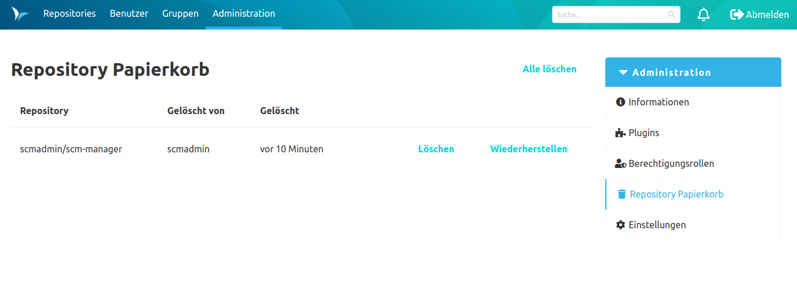
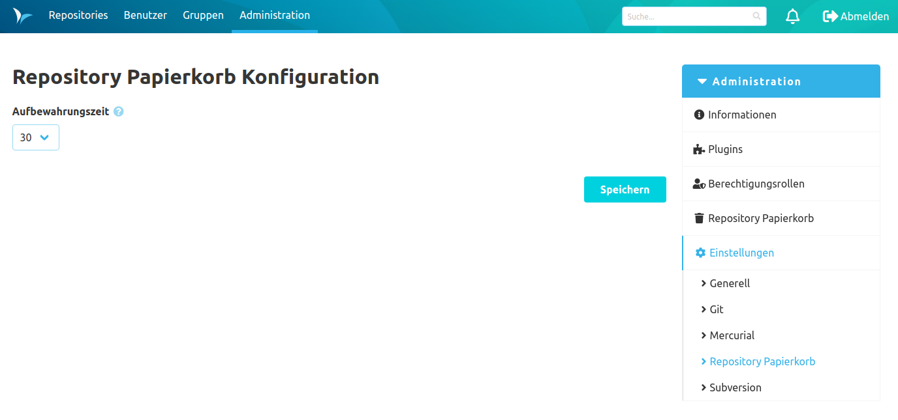

Solange es installiert ist, erstellt das Repository Trash Bin Plugin automatisch temporäre Sicherungen vor der
Löschung eines Repositories.

Der Repository-Papierkorb befindet sich in der Administrationsoberfläche.
Administratoren können Einträge im Papierkorb manuell wieder herstellen oder löschen.

Einträge im Papierkorb werden automatisch nach einer konfigurierbaren Aufbewahrungszeit gelöscht. 
Der Standardwert für die Aufbewahrungszeit beträgt 30 Tage.

