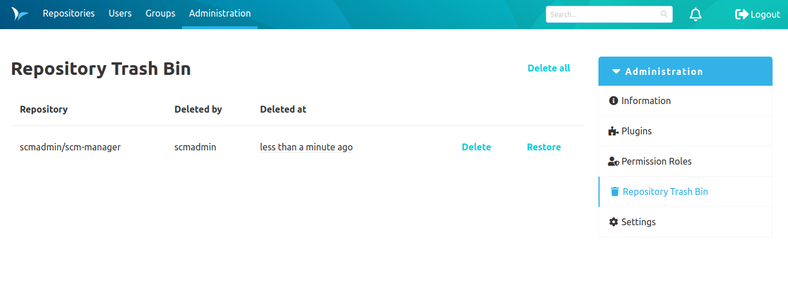
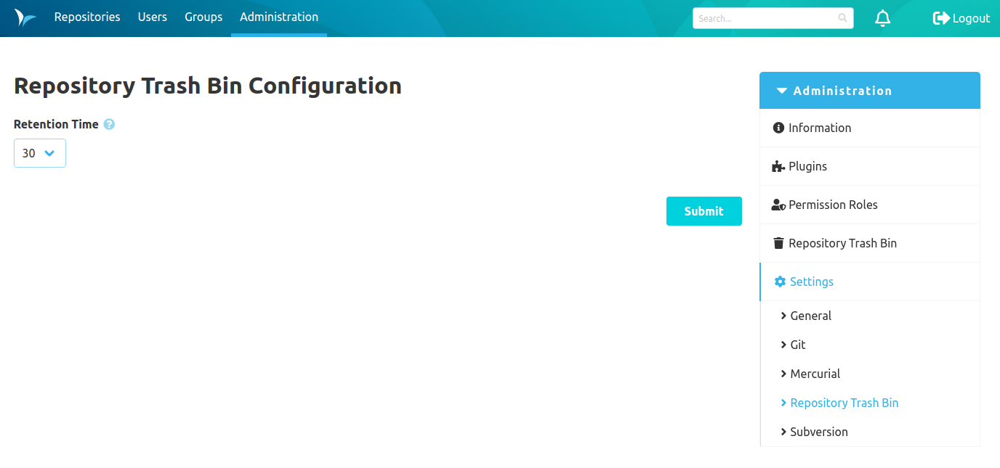

Once installed, the Repository Trash Bin Plugin creates a temporary snapshot whenever a repository is deleted.

The repository trash bin is available in the administration section.

Trash bin entries can be restored or deleted by administrators.

Trash bin entries automatically expire after a configurable time period, which defaults to 30 days.

